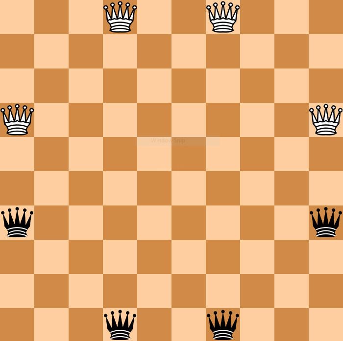

## Amazons chess

play amazons chess with AI or your friend through network.

## Game of the Amazons

White moves first, and the players alternate moves thereafter. Each move consists of two parts. First, one moves one of one's own amazons one or more empty squares in a straight line (orthogonally or diagonally), exactly as a queen moves in chess; it may not cross or enter a square occupied by an amazon of either color or an arrow. Second, after moving, the amazon shoots an arrow from its landing square to another square, using another queenlike move. This arrow may travel in any orthogonal or diagonal direction (even backwards along the same path the amazon just traveled, into or across the starting square if desired). An arrow, like an amazon, cannot cross or enter a square where another arrow has landed or an amazon of either color stands. The square where the arrow lands is marked to show that it can no longer be used. The last player to be able to make a move wins. Draws are impossible.

## Install environment

- Install [python](https://www.python.org/downloads/)
- Install [pygame-menu](https://github.com/ppizarror/pygame-menu): `pip install pygame-menu` (*)
- Install [pygame](https://www.pygame.org/docs/): `pip install pygame`

## Personal information
-Intro: I implemented this game as a small project when I was a third year student  
-Name: ThanhLongDo  
-Degree: engineer's degree in computer Science, Bach Khoa University  
-Email: 1511799@hcmut.edu.vn

(*) : Thanks to Dr. Nils Christian Ditzel from Germany. If you can't run the game due to syntax errors related to pygame-menu, please try this command: `pip install pygame-menu==1.96.1`

